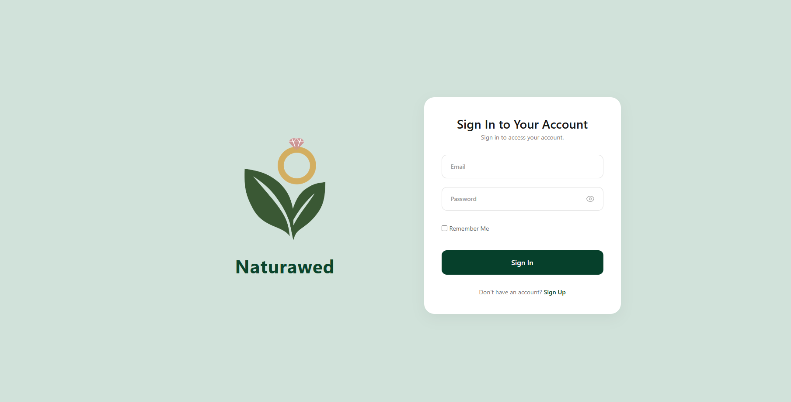
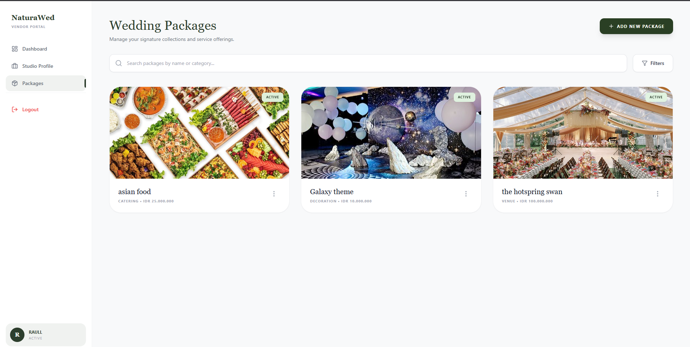
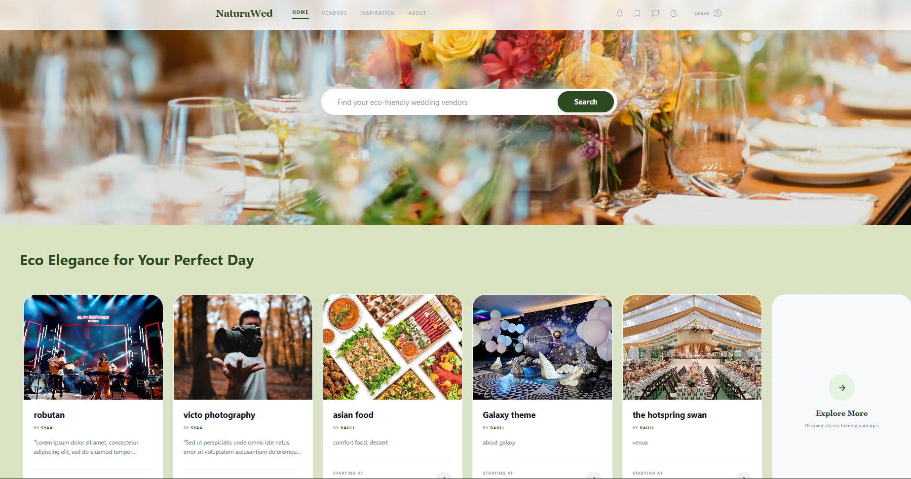
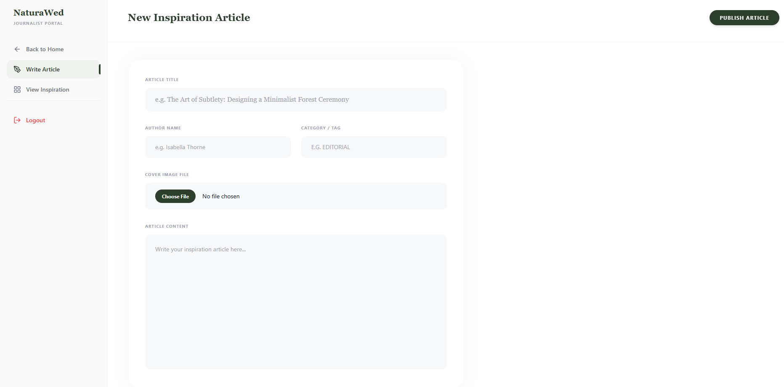
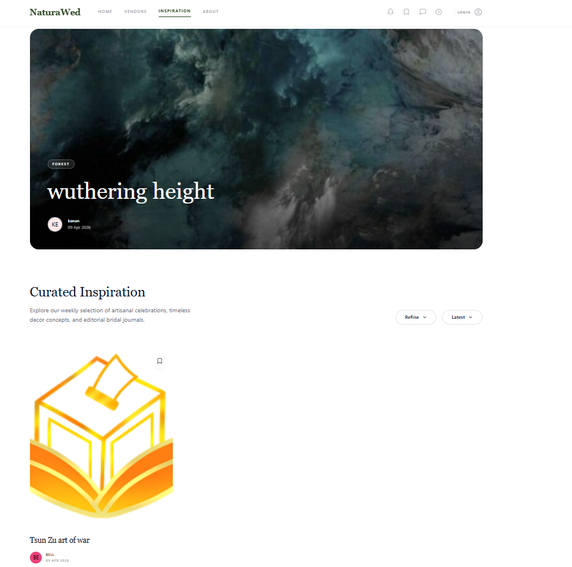

| Kategori          | Deskripsi Proyek                                                                                                  |
| :---------------- | :---------------------------------------------------------------------------------------------------------------- |
| **Nama Platform** | **NATURAWED**                                                                                                     |
| **Goal**          | Menjembatani kesenjangan antara penyedia jasa pernikahan ramah lingkungan dengan calon mempelai yang peduli alam. |
| **Solusi**        | Menyediakan akses terpusat ke berbagai vendor _eco-friendly_ yang telah terverifikasi.                            |

| Kategori          | Teknologi       |
| :---------------- | :-------------- |
| **Language**      | PHP, JavaScript |
| **Database**      | MySQL           |
| **CSS Framework** | Tailwind        |

fitur

1. Otentikasi Pengguna dan Personal
2. Manajemen, Profil, Paket Pernikahan
3. Alur Pemesanan dan Transaksi (Checkout Flow)
4. Riwayat booking
5. Publikasi Konten Literasi dan Inspirasi Pernikahan

team

1. Azarya Yanuar Krisyanto - 24082010012
2. Icha Leona Ardianti - 24082010015
3. Athalia Jevon Priyadi - 24082010026

pembagian beban kerja

1. Otentikasi Pengguna dan Personal - Icha
2. Manajemen Paket Pernikahan - Azarya
3. Alur Pemesanan dan Transaksi (Checkout Flow) - Jevon
4. Riwayat booking - Jevon
5. Publikasi Konten Literasi dan Inspirasi Pernikahan - Azarya
6. Desain website - Icha

Preview Website

1. Authentication
   

2. Package manage
   

3. Home Page
   

4. Article create
   

5. inspiration page
   
